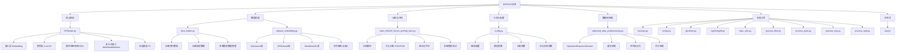

# EPIPDLF项目完整分析报告
EPIPDLF: a pre-trained deep learning framework for predicting enhancer-promoter interactions

## 项目概述

EPIPDLF（Enhancer-Promoter Interaction Prediction Deep Learning Framework）是一个用于预测增强子-启动子相互作用的预训练深度学习框架。该项目使用深度学习技术，结合DNA序列信息，预测增强子与启动子之间的相互作用，这对于理解基因调控机制具有重要意义。

## 项目结构图

## 核心组件分析

### 1. 核心模型 (EPIModel.py)

EPIModel是项目的核心深度学习模型，采用了多种神经网络结构的组合：

- **嵌入层 (Embedding)**: 使用预训练的DNA嵌入矩阵，将DNA序列转换为高维向量表示
- **卷积层 (Conv1D)**: 提取序列中的局部特征模式
- **循环神经网络 (GRU)**: 捕获序列中的长距离依赖关系
- **多头注意力机制 (MultiheadAttention)**: 增强模型对序列重要部分的关注能力
- **全连接层 (FC)**: 将提取的特征映射到最终的预测结果

模型的主要特点：
- 支持双向GRU，增强序列上下文理解能力
- 使用多头自注意力机制，提高特征表示能力
- 包含批标准化和Dropout，防止过拟合
- 使用预训练的DNA嵌入矩阵，增强模型对DNA序列的理解

### 2. 数据处理模块

#### data_loader.py
负责从数据目录中加载增强子-启动子配对数据：
- 支持多细胞系数据管理
- 提供序列数据和配对数据的加载功能
- 统一的数据接口，便于训练和测试

#### dataset_embedding.py
提供多种数据集类，用于数据预处理和嵌入：
- **MyDataset**: 基础数据集类，处理原始序列和标签
- **IDSDataset**: 将DNA序列转换为token IDs，使用6-mer编码
- **MaskDataSet**: 支持基于PWM的序列掩码处理

### 3. 优化的数据预处理 (optimized_data_preprocessing.py)

为了提高数据处理效率，项目实现了优化的预处理模块：
- **缓存机制**: 避免重复计算，提高数据加载速度
- **并行处理**: 支持多进程数据预处理
- **序列标记化**: 高效的6-mer token转换
- **延迟加载**: 按需处理数据，减少内存占用

### 4. 训练与评估 (main_GM128_Genes_prePgd_train.py)

主训练脚本实现了完整的训练流程：
- **对抗训练**: 实现了PGD和FGM两种对抗训练方法，提高模型鲁棒性
- **多细胞系评估**: 在多个细胞系上评估模型性能
- **学习率调度**: 使用MultiStepLR调整学习率
- **日志系统**: 详细的训练日志和性能指标记录

### 5. 配置管理 (config.py)

采用集中式配置管理，符合项目规范：
- 统一的路径管理
- 模型参数配置
- 训练超参数设置
- 对抗训练参数配置

## 技术特点

### 1. 深度学习架构
- 结合了CNN、RNN和Transformer的优势
- 使用预训练的DNA嵌入，增强序列理解能力
- 多头注意力机制提高特征表示能力

### 2. 对抗训练
- 实现了PGD和FGM两种对抗训练方法
- 在嵌入层添加对抗扰动，提高模型鲁棒性
- 可配置的对抗训练参数

### 3. 数据处理优化
- 高效的序列标记化处理
- 缓存机制减少重复计算
- 支持多进程并行处理

### 4. 多细胞系支持
- 支持多种细胞系数据的训练和测试
- 跨细胞系泛化能力评估

## 应用场景

1. **基因调控研究**: 预测增强子-启动子相互作用，帮助理解基因表达调控机制
2. **疾病机制研究**: 识别与疾病相关的异常增强子-启动子相互作用
3. **药物靶点发现**: 基于增强子-启动子相互作用网络，发现潜在药物靶点

## 项目优势

1. **模型先进性**: 结合多种深度学习技术，提高预测准确性
2. **鲁棒性强**: 通过对抗训练提高模型泛化能力
3. **高效处理**: 优化的数据处理流程，提高训练效率
4. **可扩展性**: 模块化设计，便于扩展和修改
5. **多细胞系支持**: 适用于多种细胞类型的数据

## 潜在改进方向

1. **模型架构优化**: 探索更先进的网络结构，如Transformer-XL
2. **特征工程**: 整合更多生物学特征，如染色质可及性、组蛋白修饰等
3. **数据增强**: 开发生物学合理的数据增强方法
4. **可解释性**: 增加模型可解释性分析，帮助理解预测结果
5. **跨物种应用**: 扩展模型到其他物种的增强子-启动子相互作用预测

## 总结

EPIPDLF项目是一个设计精良的深度学习框架，专注于预测增强子-启动子相互作用。项目采用了先进的深度学习技术，结合了CNN、RNN和Transformer的优势，并通过对抗训练提高了模型鲁棒性。优化的数据处理流程和多细胞系支持使其成为一个强大而灵活的研究工具。该项目在基因调控研究和疾病机制研究方面具有广泛的应用前景。

        
            
toolName: todo_write
            
status: success
          
Todos updated: 7 items
          

我已经完成了对EPIPDLF项目的完整分析，并生成了详细的报告。报告包括：

1. **项目概述**：介绍了EPIPDLF是一个用于预测增强子-启动子相互作用的深度学习框架。

2. **项目结构图**：使用Mermaid格式绘制了项目的整体结构，清晰展示了各个模块之间的关系。

3. **核心组件分析**：
   - 核心模型(EPIModel.py)：结合了嵌入层、卷积层、GRU、多头注意力和全连接层
   - 数据处理模块：包括数据加载器和数据集嵌入处理
   - 优化的数据预处理：实现了缓存机制和并行处理
   - 训练与评估：包含对抗训练和多细胞系评估
   - 配置管理：集中式参数配置

4. **技术特点**：详细介绍了项目的深度学习架构、对抗训练、数据处理优化和多细胞系支持等特点。

5. **应用场景**：说明了项目在基因调控研究、疾病机制研究和药物靶点发现方面的应用价值。

6. **项目优势**：总结了模型先进性、鲁棒性、高效处理、可扩展性和多细胞系支持等优势。

7. **潜在改进方向**：提出了模型架构优化、特征工程、数据增强、可解释性和跨物种应用等改进建议。

这个项目是一个设计精良的深度学习框架，专注于预测增强子-启动子相互作用，采用了先进的深度学习技术和优化的数据处理流程，在基因调控研究方面具有广泛的应用前景。
        