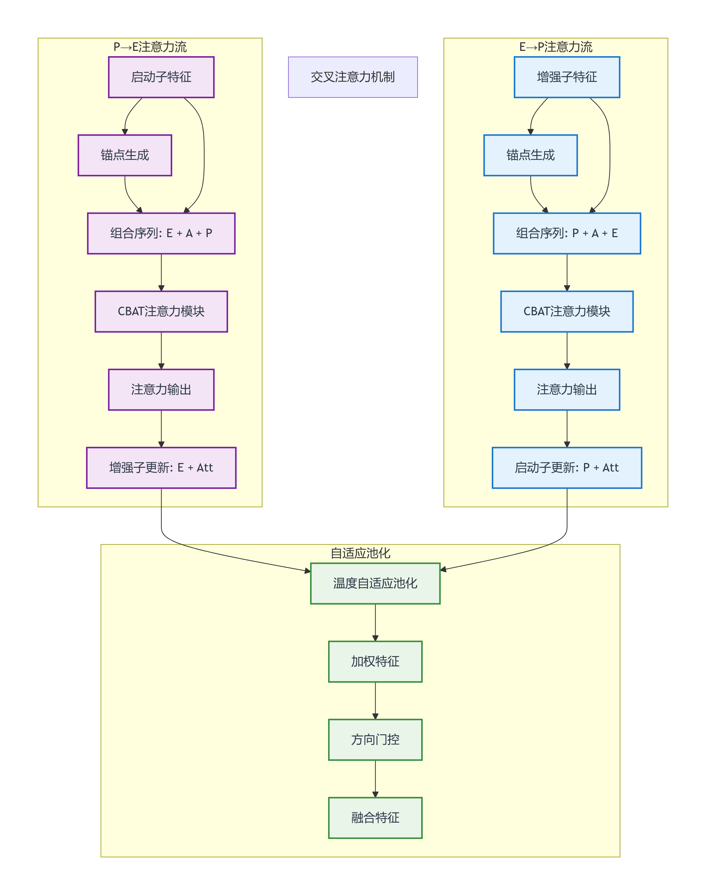
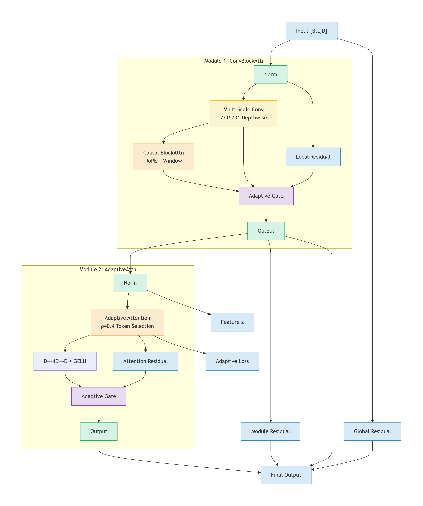
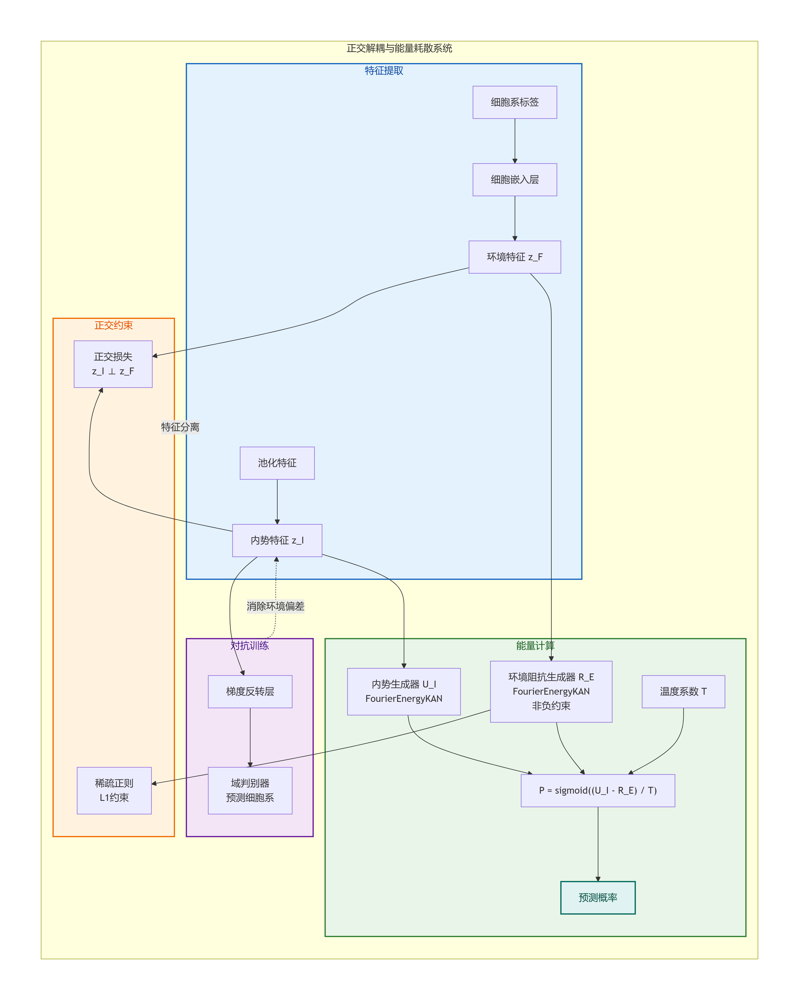

# PRISM: Predictive RNA-seq-independent Interaction System for genomic Modifiers

PRISM 是一个用于预测基因组序列中增强子-启动子 (Enhancer-Promoter, EP) 互作的深度学习系统。该项目旨在仅利用 DNA 序列信息，通过复杂的神经网络架构挖掘 EP 互作关系，并特别关注跨细胞系的泛化性能和鲁棒性。

## **核心任务**
- **目标**: 仅使用 DNA 序列信息预测增强子与启动子之间的相互作用。
- **挑战**: 不同细胞系间的特异性差异巨大。PRISM 通过引入能量耗散框架和域对抗训练，致力于解决单一模型在未见细胞系上失效的问题。

---

## **核心架构**

PRISM 采用了多项先进技术构建其模型架构 `PRISMBackbone`：


### **1. 旋转位置编码 (RoPE - Rotary Positional Embedding)**
RoPE 通过在复数空间旋转特征向量来注入位置信息，解决了传统绝对位置编码无法良好处理长序列和相对位置的问题。

**数学原理：**
- **变换公式**: 对于 $d$ 维向量中的第 $i$ 对维度 $(x_{2i}, x_{2i+1})$，在位置 $m$ 处的旋转变换为：

$$
\begin{pmatrix} f(x, m)_{2i} \\ f(x, m)_{2i+1} \end{pmatrix} = \begin{pmatrix} \cos(m\theta_i) & -\sin(m\theta_i) \\ \sin(m\theta_i) & \cos(m\theta_i) \end{pmatrix} \begin{pmatrix} x_{2i} \\ x_{2i+1} \end{pmatrix}
$$

其中频率 $\theta_i = 10000^{-2i/d}$。
- **相对位置不变性**: RoPE 的核心优势在于两个向量 $q$ 和 $k$ 的内积仅取决于它们的相对距离 $m-n$：

$$
\langle f(q, m), f(k, n) \rangle = g(q, k, m-n)
$$

- **长序列扩展**: 针对 DNA 序列的超长特性，引入了线性缩放因子 $\lambda$，当序列长度 $L > L_{train}$ 时，频率调整为 $\theta_i^\prime = \theta_i / (L/L_{train})$。

### **2. 注意力机制与 CBAT 模块**

- **跨序列注意力**: 结合增强子和启动子的特征，进行深度特征融合。
- **CBAT (Cross-Boundary Attention Transformer)**: 自定义的交叉边界注意力机制，专门用于建模增强子与启动子之间的长距离交互。
  

### **3. 傅里叶 KAN (FourierKAN)**
基于 Kolmogorov-Arnold 表示定理，FourierKAN 放弃了传统 MLP 的线性权重，转而学习边上的非线性基函数。

**数学原理：**
- **KAN 表示定理**: 任意多元连续函数可表示为一元函数的叠加：

$$
f(x_1, \dots, x_n) = \sum_{q=1}^{2n+1} \Phi_q \left( \sum_{p=1}^n \phi_{q,p}(x_p) \right)
$$

- **傅里叶级数参数化**: 在 `FourierKAN` 中，$\phi_{q,p}$ 被参数化为：

$$
\phi_{i,j}(x_j) = \sum_{k=0}^{G} \left[ a_{ijk} \cos(k\tilde{x}_j) + b_{ijk} \sin(k\tilde{x}_j) \right]
$$

其中 $G$ 为网格大小，$a, b$ 为可学习参数。
- **输入域映射**: 通过 $\tilde{x}_j = \tanh(x_j) \cdot \pi$ 将输入映射到 $[-\pi, \pi]$ 空间，确保级数在有效频率内振荡。

### **4. 能量耗散系统 (Energy Dissipation)**

**数学原理：**
- **物理建模**: 模拟能量在环境中的耗散过程，增强模型的可解释性：

$$
P(y=1) = \text{sigmoid}\left( \frac{U_I - R_E}{T} \right)
$$

- **内势 $U_I$ (Internal Potential)**: 代表序列本身的固有属性。
- **环境阻抗 $R_E$ (Environmental Resistance)**: 代表细胞系特有的环境影响，模型强制其非负。
- **温度系数 $T$**: 可学习的缩放参数，控制预测的灵敏度。

---

## **训练与优化策略**

### **1. 域对抗训练 (Domain Adaptation)**
引入 **GRL (Gradient Reversal Layer)** 梯度反转层，配合域判别器，强迫模型从序列中提取与细胞系无关的通用特征 $z_I$，提升在未见细胞系上的泛化能力。

### **2. 自适应 IMMAX 损失 (AdaptiveIMMAXLoss)**
针对 EP 互作正负样本极度不平衡的特性，通过对偶优化理论动态寻找最优的类别权重。

**数学原理：**
- **损失目标**:

$$
\mathcal{L} = \frac{1}{2} \left( \frac{1}{n_+} \sum_{i \in \text{pos}} \Psi\left(\frac{z_i}{\alpha}\right) + \frac{1}{n_-} \sum_{i \in \text{neg}} \Psi\left(\frac{z_i}{1-\alpha}\right) \right)
$$

其中 $z_i$ 为有符号 Margin，$\Psi(u) = \log(1 + e^{-u})$。
- **权重自适应更新**: 权重 $\alpha$ 通过样本困难度 $S$ 动态计算并配合 EMA 平滑：

$$
\alpha^* = \frac{\sqrt{S_+}}{\sqrt{S_+} + \sqrt{S_-}}, \quad S = \sum |z_i \cdot \Psi^\prime(z_i/\alpha)|
$$

---

## **项目结构**

```text
PRISM/
├── PRISM.py              # 主训练脚本
├── predict.py            # 模型评估和推理脚本
├── config.py             # 集中参数配置管理
├── data_loader.py        # 数据加载工具
├── models/               # 模型定义目录
│   ├── PRISMModel.py     # 主模型架构
│   ├── layers/           # 自定义网络层 (CBAT, RoPE, FourierKAN 等)
│   └── pleat/            # 工具包 (Embedding, Loss 函数等)
├── domain-kl/            # 数据集目录
├── save_model/           # 模型检查点保存路径
├── log/                  # 训练和评估日志
└── vocab/                # 词表和细胞类型配置文件
```

---

## **快速开始**

### **环境要求**
- Python 3.10+
- PyTorch, NumPy, Pandas, Scikit-learn, Matplotlib, tqdm

### **1. 配置参数**
在 `config.py` 中调整 `PRISM_BATCH_SIZE`、`LEARNING_RATE`、`EPOCH` 等超参数。

### **2. 模型训练**
```bash
python PRISM.py
```

### **3. 模型评估**
```bash
python predict.py
```

---

## **主要指标**
PRISM 致力于攻克跨细胞系预测瓶颈

## **联系与反馈**
如有任何问题或建议，请联系开发团队。
